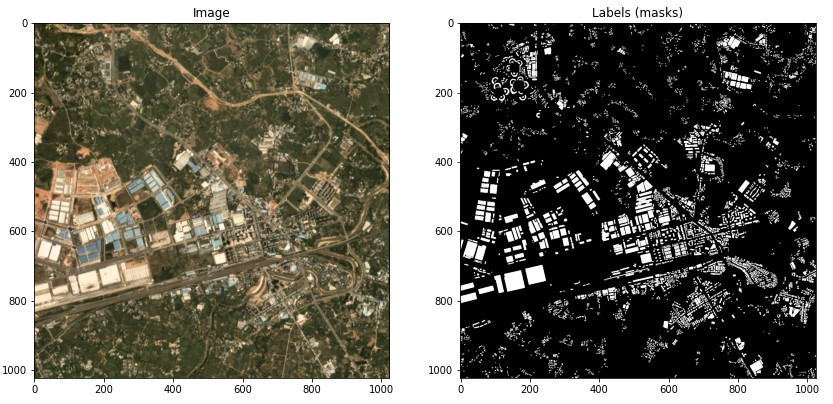
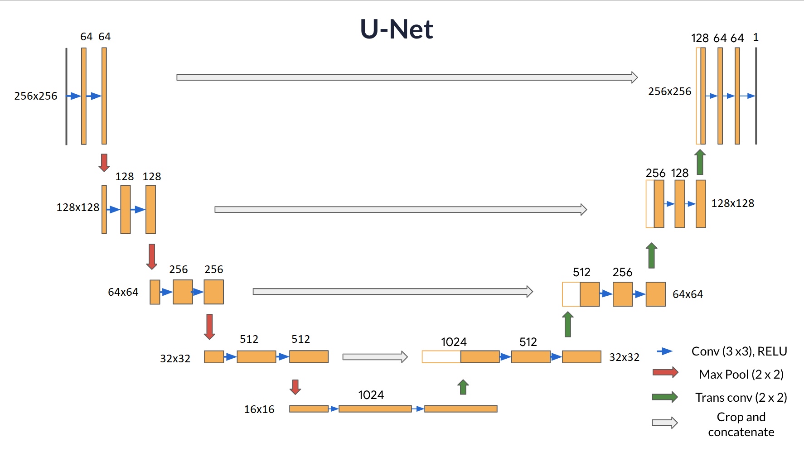
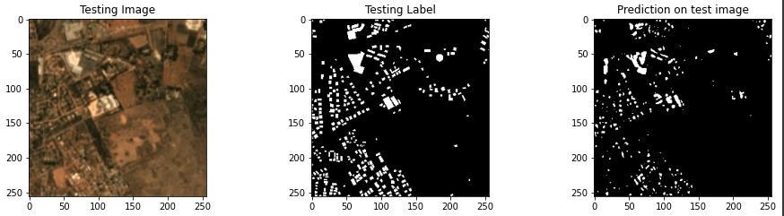
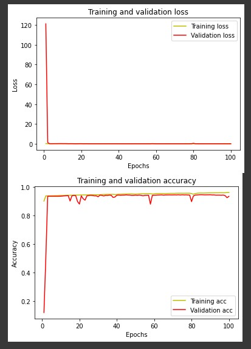

##### I couldn't upload the images because of space availability. But please let me know if need them. I'll be more than happy to share them. 

#### building footprints detection in satellite imagery  

##### Findings on the dataset 

First, let's visualize the **images** and their labels (I use more **masks** in the code). The **images** are the colored tiff files and **masks** are the buildings in binary tiff files.  

<caption>
 <u><b> Figure 01 </u></b>: U-Net Architecture  
</caption>

Let's also check the dimensions of the first 5 entries in the dataset for images  

    (1023, 1024, 4)
    (1023, 1024, 4)
    (1024, 1024, 4)
    (1024, 1024, 4)
    (1024, 1024, 4)
    (1024, 1024, 4)

and labels  

    (1023, 1024)
    (1023, 1024)
    (1024, 1024)
    (1024, 1024)
    (1024, 1024)
    (1024, 1024)
    

As we can see they aren't always the same, so this has to be corrected. Also, images have 4 channels but I will work only with the first 3.  

Also, the masks are binary images.  

##### The explanation of the solution

The dimensions of the dataset have to be corrected. For that, each image and mask has to be padded to 1024x1024 shape by adding a layer of zeros so that the data has the same dimension. That job does "expand2square" function in the script "functions.py". I took the code from [here](https://note.nkmk.me/en/python-pillow-add-margin-expand-canvas/). Next, I extracted 256x256 patches from the images using "patchify" package and the code from [here](https://github.com/bnsreenu/python_for_microscopists/blob/master/Tips_Tricks_5_extracting_patches_from_large_images_and_masks_for_semantic_segm.py). Then, I used "U-Nets" as  network architecture. I knew it could work on image segmentation since I learned in during the Deep Learning Specialization Course. [Here](https://github.com/kenhding/Coursera/blob/master/Deep_Learning_Specialization/Course_4_Convolutional_Neural_Networks/Week3/DL_C4_week3_2_Image_Segmentation_with_U-Net_v2.ipynb) is the link to the github repo for the code. But their implementation for multiclass problem, whereas the project is with binary images, hence - binary classifiction. I found another implementation of precisely binary classification [here](https://github.com/bnsreenu/python_for_image_processing_APEER/blob/master/tutorial118_binary_semantic_segmentation_using_unet.ipynb).
A U-Net would work for this problem since it replaces dense layers with transposed convolution layers. This helps preserving the spatial information that is otherwise lost by usuing dense layers. Also, it adds skip connections to downsampling convolutional layers from transposed convolutional layers, thus helping preserve the information in the network.

Below you can see the scheme of the network:  

<caption>
 <u><b> Figure 01 </u></b>: U-Net Architecture  
</caption>

The decoder part of the network starts with 256x256 input. In detail, it consists of the repeated application of two 3 x 3 convolutions with "same" padding, each followed by a ReLu and a 2 x 2 max pooling operation with stride 2 for downsampling. At each downsampling step, the number of feature channels is doubled. 

Crop and concatenate step crops the image from the contracting path and concatenates it to the current image on the expanding path to create a skip connection.  

At each step of the encoder part the inputs are upsampled by the transposed convolution, followed by two 3 x 3 convolutions. This transposed convolution halves the number of channels, while doubling the input dimensions.  

In the final layer, a 1x1 convolution is used to map each 64-component feature vector to the number of classes. For binary classification sigmoid activation is used.

Images and masks are scaled dividing by 255 and the validation set is 20% of all original dataset. Binary cross entropy is used as loss function, as an optimization algorithm "Adam" (with learning rate = 0.001) and mean IoU (intersection over unit) to evaluate the learning. During the compilation "accuracy" is set as a metric but actually it is not a good metric to judge the convergence from, since the labels contain many true negatives (the black fone). 

Activation = (TP + TN)/(TN + TP + FN + FP)  

whereas  

IoU = TP / (TP + FP + FN)  

After the compilation is over the weights of the model are exported and then imported and MeanIoU is used to evaluate the model performance. 

I first tried with grayscale images to test the model and then I worked with colored images. Colored images gave a little bit higher values for MeanIoU (approx. 0.2-0.3 bigger). Below results are for 100 iterations (epochs) on colored images on Google Colab using 1 GPU. It gave MeanIoU = 0.6205597. The results seem promising but tuning of the parameters is required.

<caption>
 <u><b> Figure 02 </u></b>: "Comparing the testing image, its groud true mask and the predicted mask"   
</caption>

<caption>
 <u><b> Figure 03 </u></b>: "Comparing the test and validation loss and accuracy."   
</caption>

##### pros and cons of the solution

###### PROS  

- It was quick to implement since I could find a suitable implementation online to try my model on
- It gave promising results on the first try (IoU = 0.62)

###### CONS

- IoU = 0.62 is still far from the best. Higher than 0.9 could be achieved
- I had to put all the test images and labels in numpy arrays, which means using more memory. Better could be to use iterators.

##### options for future improvements

- I could use TensorFlow datasets for more dynamic storage of images https://www.tensorflow.org/api_docs/python/tf/data/Dataset
- A test with 5x5, 7x7 filters to see if the IoU increases. I wouldn't increase a lot filter size since building are small in the images.
- Reducing the size of pathces to 128x128
- Playing with learning rate
- I am not sure about using regularization techinuques like Dropout since from the Fig. 03 we see Training and Validation curves are very close. So no visible high variance issues. But it can be tested for smaller number of iterations.
